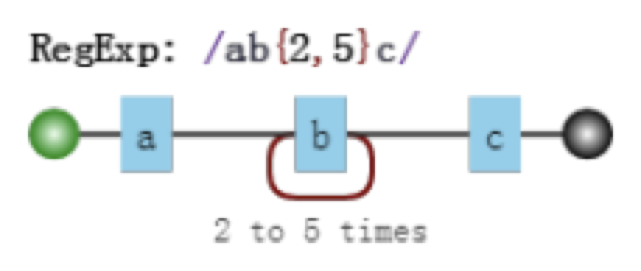
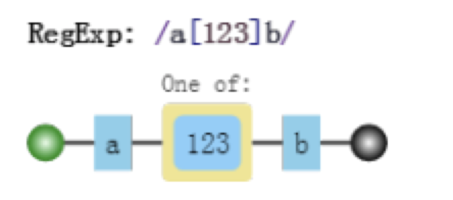
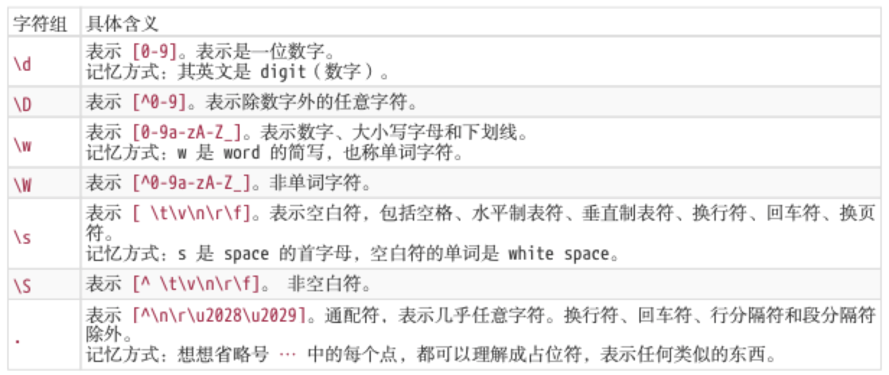
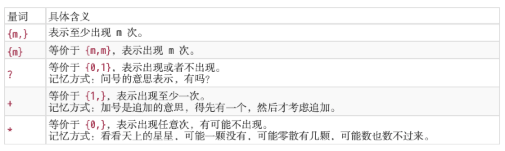
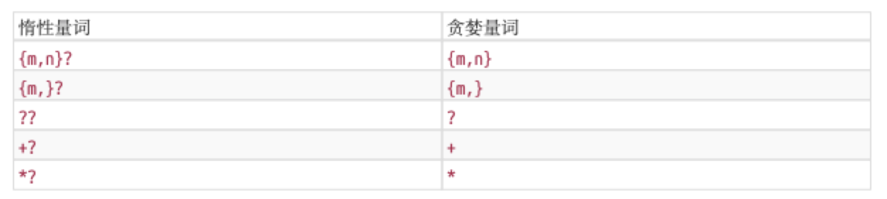
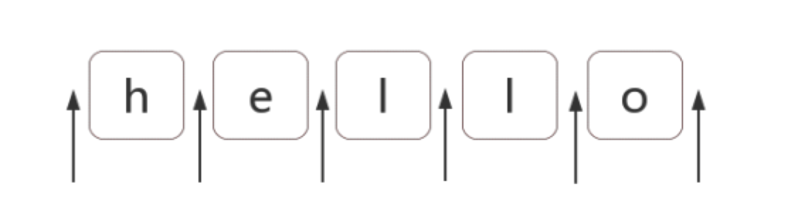
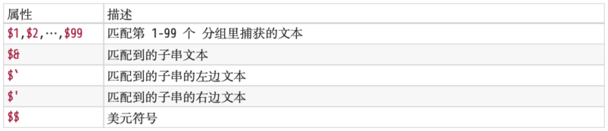
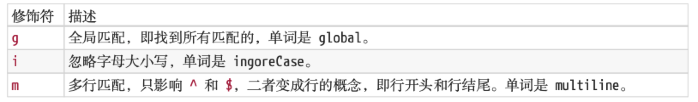

# 《JavaScript正则表达式迷你书》总结
> 正则表达式 = 匹配模式 = 匹配字符 + 匹配位置
## 第一章 正则表达式字符匹配攻略
#### 1.1 两种模糊匹配
1. 横向模糊匹配（使用量词）
    * 可视化形式；
    
    * 例子；
    ```js
    var regex = /ab{2,5}c/g;
    var str = 'abc abbc abbbc abbbbc abbbbbc abbbbbbc';
    console.log(str.match(regex));  // [ 'abbc', 'abbbc', 'abbbbc', 'abbbbbc' ]
    ```
2. 纵向模糊匹配（使用字符组）
    * 可视化形式；
    
    * 例子；
    ```js
    var regex = /a[123]b/g;
    var str = 'a0b a1b a2b a3b a4b';
    console.log(str.match(regex));  // [ 'a1b', 'a2b', 'a3b' ]
    ```
#### 1.2 字符组
1. 范围表示法
    * `[123456abcdefGHIJKLM]` 可以写成 `[1-6a-fG-M]`；
    * 注意：想要匹配`a`、`-`、`z`这三者中任意一个字符，可以写成`[-az]`或`[az-]`或`[a\-z]`。
2. 排除字符组
    * 想要表示一个除`a`、`b`、`c`之外的任意一个字符，可以在字符组的第一位放`^`（脱字符），即`[^abc]`。
3. 常见的字符组简写形式
    * 
    * 匹配任意字符，可以使用`[\d\D]`、`[\w\W]`、`[\s\S]`和`[^]`中任何一个。
#### 1.3 量词
1. 简写形式
    
    * 
2. 贪婪匹配
    ```js
    var regex = /\d{2,5}/g;
    var str = '123 1234 12345 123456';
    console.log(str.match(regex));  // [ '123', '1234', '12345', '12345' ]
    ```
    从上面例子看出，对于量词{2,5}，它会尽可能多地去匹配，这就是贪婪匹配。
3. 惰性匹配
    很多时候我们不想使用贪婪模式去匹配，那么就要使用惰性匹配的方式了。
    ```js
    var regex1 = /\d{2,5}?/g;
    var str = '123 1234 12345 123456';
    console.log(str.match(regex));
    // ["12", "12", "34", "12", "34", "12", "34", "56"]
    ```
    这就是惰性匹配，尽可能少地去匹配。
    * 所有的惰性匹配情形；
    
#### 1.4 多选分支
1. 字符组是对单个字符取或，如果想对多个字符拼成的像单词这样的形式取或的话就要使用到多选分支；
2. 例子；
```js
var regex = /good|nice/g;
var str = 'good idea, nice try';
console.log(str.match(regex));  //  ['good', 'nice' ]
```
3. 注意：多选分支是惰性匹配的。
```js
var regex = /good|goodbye/g;
var str = 'goodbye';
console.log(str.match(regex));  // ['good']
```
***
## 第二章 正则表达式位置匹配攻略
#### 2.1 位置
> 位置（锚）是相邻字符之间的位置。 



#### 2.2 匹配位置
> 在`ES5`中，共有6个锚：`^`、`$`、`\b`、`\B`、`(?=p)`、`(?!p)`
1. `^`和`$`
    * `^`：匹配每一行的开头；
    * `$`：匹配每一行的结尾；
    * 例子：
    ```js
    var str = 'hello\nworld\ni\nam\nfine';
    console.log(str.replace(/^|$/gm, '#'));
    /* 
    #hello#
    #world#
    #i#
    #am#
    #fine#
    */
    ```
2. `\b`和`\B`
    * `\b`
        
        > 单词边界。包括`\w`和`\W`之间、`\w`和`^`之间、`\w`和`$`之间。
    * `\B`
        
        > 非单词边界。除了`\b`的位置，别的都是`\B`。
    * 例子：
        ```js
        console.log('[apple] test.mp4'.replace(/\b/g, '#'));  // [#apple#] #test#.#mp4#
        console.log('[apple] test.mp4'.replace(/\B/g, '#'));  // #[a#p#p#l#e]# t#e#s#t.m#p#4
        ```
3. `(?=p)`和`(?!p)`
    * `(?=p)`
        
        > 正向先行断言。即该位置后面的字符要匹配p。
    * `(?!p)`
        
        > 负向先行断言。即该位置后面的字符不能匹配p。
    * 例子：
        ```js
        console.log('hello'.replace(/(?=l)/g, '#'));  // he#l#lo
        console.log('hello'.replace(/(?!l)/g, '#'));  // #h#ell#o#
        ```
#### 2.3 位置的特性
> 对于位置，可以直接理解成空字符""。

例子：
```js
console.log(/^^hello$$$/.test('hello'));  // true
console.log(/(?=he)^^he(?=\w)llo$\b\b$/.test('hello'));  // true
```
***
## 第三章 正则表达式括号的作用
> 正则引擎在匹配过程中，给每一个分组都会开辟一个空间，用来存储每一个分组匹配到的数据。括号的作用其实就是提供了分组，便于我们引用它。

#### 3.1 提取数据
**主要有三种提取方法，以提取年月日为例：**
1. 字符串的`match`方法;
```js
var regex = /(\d{4})-(\d{2})-(\d{2})/;
var str = '2020-09-20';
console.log(str.match(regex));
/* 
[
  '2020-09-20',
  '2020',  // 组
  '09',  // 组
  '20',  // 组
  index: 0,
  input: '2020-09-20',
  groups: undefined
]
*/

```
2. 正则对象的`exec`方法;
```js
var regex = /(\d{4})-(\d{2})-(\d{2})/;
var str = '2020-09-20';
console.log(regex.exec(str));
/* 
[
  '2020-09-20',
  '2020',  // 组
  '09',  // 组
  '20',  // 组
  index: 0,
  input: '2020-09-20',
  groups: undefined
]
*/
```
3. 构造函数`RegExp`的全局属性`$1`至`$9`来获取;
```js
var regex = /(\d{4})-(\d{2})-(\d{2})/;
var str = '2020-09-20';
// 获取之前必须先进行正则操作，例如：
// regex.test(str);
// regex.exec(str);
str.match(regex);
console.log(RegExp.$1);  // 2020
console.log(RegExp.$2);  // 09
console.log(RegExp.$3);  // 20
```
#### 3.2 替换
**替换主要有下面三种方式：**
```js
var regex = /(\d{4})-(\d{2})-(\d{2})/;
var str = '2020-09-20';
// 方式一
console.log(str.replace(regex, '$2/$3/$1'));  // 09/20/2020
// 方式二
console.log(str.replace(regex, function() {
    return RegExp.$2 + '/' + RegExp.$3 + '/' + RegExp.$1;
}));
// 方式三
console.log(str.replace(regex, function(match, year, month, day) {
    console.log(match);  // 2020-09-20
    return month + '/' + day + '/' + year;
}));
```
#### 3.3 反向引用（\1、\2、...）
**正则里面想要获取分组可以使用反向引用**
* 例1：我们想要下面的分割符前后一致，可以使用`\1`表示前面第一个匹配的的分组。同理`\2`的意思则表示匹配到的第二个分组。
```js
var str1 = '2020-09-20';
var str2 = '2020/09/20';
var str3 = '2020.09.20';
var str4 = '2020-09/20';
var regex = /\d{4}(-|\/|\.)\d{2}\1\d{2}/;
console.log(regex.test(str1));  // true
console.log(regex.test(str2));  // true
console.log(regex.test(str3));  // true
console.log(regex.test(str4));  // false
```
#### 3.3.1 括号嵌套以左括号为准
```js
var regex = /^((\d)(\d(\d)))\1\2\3\4$/;
var str = '1231231233';
console.log(regex.test(str));  // true
console.log(RegExp.$1);  // 123
console.log(RegExp.$2);  // 1
console.log(RegExp.$3);  // 23
console.log(RegExp.$4);  // 3
```
#### 3.3.2 `\10`表示第十个分组
```js
var regex = /(1)(2)(3)(4)(5)(6)(7)(8)(9)(#) \10+/;
var string = "123456789# ######"
console.log( regex.test(string) );  // true
```
#### 3.3.3 引用不存在的分组则会匹配字符本身
```js
var regex = /\1\2\3\4\5\6/;
console.log(regex.test('\1\2\3\4\5\6'));  // true
```
#### 3.3.4 分组后面有量词则最终捕获到的是最后一次的匹配
```js
var regex = /(\d)+ \1/;
console.log(regex.test('12345 1'));  // false
console.log(regex.test('12345 5'));  // true
```
#### 3.4 如果不想让括号里面的数据被捕获可以使用非捕获括号`(?:p)`和`(?:p1|p2|p3)`
所以如果我们想要匹配`\10`这个字符的话可以这么写：
`(?:\1)0`或者`\1(?:0)`
***
## 第七章 正则表达式编程
#### 7.1 正则表达式的四种操作
##### 7.1.1 验证
**`search`、`test`、`match`、`exec`**
```js
var regex = /\d/;
var string = 'abc123';
console.log(!!~string.search(regex));  // true
console.log(regex.test(string));  // true
console.log(!!string.match(regex));  // true
console.log(!!regex.exec(string));  // true
```
**`tips:`**
`~a=-(a+1)`，所以对于像`indexOf`和`search`这种只返回索引或者`-1`的`api`,可以这么用：
```js
var arr = ['a', 'b'];
console.log(!!~arr.indexOf('a'))  // 只返回布尔值
```
##### 7.1.2 切分
**`split`**
```js
var regex = /,/;
var str = 'html,css,js';
console.log(str.split(regex));  // [ 'html', 'css', 'js' ]
```
##### 7.1.3 提取
**`match`、`exec`、`test`、`search`、`replace`**
```js
var regex = /^(\d{4})\D(\d{2})\D(\d{2})$/;
var string = '2020-06-26';
// match
console.log(string.match(regex).slice(1, 4));  // [ '2020', '06', '26' ]
// exec
console.log(regex.exec(string).slice(1, 4));  // [ '2020', '06', '26' ]
// test
regex.test(string);
console.log([RegExp.$1, RegExp.$2, RegExp.$3]);  // [ '2020', '06', '26' ]
// search
string.search(regex);
console.log([RegExp.$1, RegExp.$2, RegExp.$3]);  // [ '2020', '06', '26' ]
// replace
var date = [];
string.replace(regex, function(match, year, month, day) {
    date.push(year, month, day);
});
console.log(date);  // [ '2020', '06', '26' ]
```
##### 7.1.4 替换
**`replace`**
```js
var string = '2020-09-26';
console.log(string.replace(/-/g, '/'));  // 2020/09/26
```
#### 7.2 相关API注意要点
**`js`中对于正则操作的方法，共有6个:**
```js
String.match
String.split
String.replace
String.search
RegExp.test
RegExp.exec
```
##### 7.2.1 `search`和`match`会把字符串转换成正则
```js
var string = '2017.06.27';
// search
console.log(string.search('.'));  // 0
// 需要替换成如下形式之一
console.log(string.search('\\.'));  // 4
console.log(string.search(/\./));  // 4
// match
console.log(string.match('.'));  // [ '2', index: 0, input: '2017.06.27', groups: undefined ]
// 需要替换成如下形式之一
console.log(string.match('\\.'));  // [ '.', index: 4, input: '2017.06.27', groups: undefined ]
console.log(string.match(/\./));  // [ '.', index: 4, input: '2017.06.27', groups: undefined ]
// split、replace
console.log(string.split('.'));  // [ '2017', '06', '27' ]
console.log(string.replace('.', '/'));  // 2017/06.27
```
##### 7.2.2 `match`返回结果的格式问题
```js
var string = '2017-9-26';
console.log(string.match(/\b(\d+)\b/));  // [ '2017', '2017', index: 0, input: '2017-9-26', groups: undefined ]
console.log(string.match(/\b(\d+)\b/g));  // [ '2017', '9', '26' ]
```
##### 7.2.3 exec比match更强大
> 当正则没有 g 时，使用 match 返回的信息和 exec 返回的信息一样。但是有 g 后，就没有关键的信息 index 了。而 exec 方法就能解决这个问题，它能接着上一次匹配后继续匹配。其中正则实例 lastIndex 属性，表示下一次匹配开始的位置。
```js
var string = '2020.9.26';
var regex = /\b(\d+)\b/g;
console.log(regex.exec(string));  // [ '2020', '2020', index: 0, input: '2020.9.26', groups: undefined ]
console.log(regex.lastIndex);  // 4
console.log(regex.exec(string));  // [ '9', '9', index: 5, input: '2020.9.26', groups: undefined ]
console.log(regex.lastIndex);  // 6
console.log(regex.exec(string));  // [ '26', '26', index: 7, input: '2020.9.26', groups: undefined ]
console.log(regex.lastIndex);  // 9
console.log(regex.exec(string));  // null
```
**`exec`经常需要`while`循环配合使用**

```js
var string = '2020.9.26';
var regex = /\b(\d+)\b/g;
var result;
while(result = regex.exec(string)) {
    console.log(result, regex.lastIndex);
}
/*
[ '2020', '2020', index: 0, input: '2020.9.26', groups: undefined ] 4
[ '9', '9', index: 5, input: '2020.9.26', groups: undefined ] 6
[ '26', '26', index: 7, input: '2020.9.26', groups: undefined ] 9
*/
```
##### 7.2.4 修饰符`g`对`exec`和`test`的影响
> 字符串的四个方法，每次匹配时，都是从 0 开始的，即 lastIndex 属性始终不变。而正则实例的两个方法 exec、test，当正则是全局匹配时，每一次匹配完成后，都会修改 lastIndex。
```js
var regex = /a/g;
console.log(regex.test('a'), regex.lastIndex);  // true 1
console.log(regex.test('aba'), regex.lastIndex);  // true 3
console.log(regex.test('ababc'), regex.lastIndex);  // false 0
```
##### 7.2.6 `split`的两点注意事项
1. 接收第二个参数，表示数组的最大长度
```js
var string = 'html,css,js';
console.log(string.split(/,/, 2));  // [ 'html', 'css' ]
```
2. 正则使用分组时，结果数组中是包含分隔符的
```js
var string = 'html,css,js';
console.log(string.split(/(,)/));  // [ 'html', ',', 'css', ',', 'js' ]
```
##### 7.2.7 `replace`第二个参数有两种表示方式
**1. 字符串**

```js
// 把'2,3,5'变成'5=2+3'
var str = '2,3,5';
console.log(str.replace(/(\d+),(\d+),(\d+)/, '$3=$1+$2'));  // 5=2+3

// 把'2,3,5'变成'222,333,555'
var str = '2,3,5';
console.log(str.replace(/(\d+)/g, '$&$&$&'));  // 222,333,555

// 把2+3=5变成2+3=2+3=5=5
var str = '2+3=5';
console.log(str.replace(/=/, "$&$`$&$'$&"));  // 2+3=2+3=5=5
```
**2. 函数**
```js
var str = '1234 5678 3579';
str.replace(/(\d)\d{2}(\d)/g, function(match, $1, $2, index, input) {
    console.log([match, $1, $2, index, input]);
});
/*
[ '1234', '1', '4', 0, '1234 5678 3579' ]
[ '5678', '5', '8', 5, '1234 5678 3579' ]
[ '3579', '3', '9', 10, '1234 5678 3579' ]
*/
```
##### 7.2.8 不建议使用构造函数生成正则，因为会多写很多`\`
```js
var string = '2020-9-26 2020.9.26 2020/9/26';
// var regex = /\d{4}(-|\.|\/)\d{1}\1\d{2}/g;
var regex = new RegExp('\\d{4}(-|\\.|\\/)\\d{1}\\1\\d{2}', 'g');
console.log(string.match(regex));  // [ '2020-9-26', '2020.9.26', '2020/9/26' ]
```
##### 7.2.9 `es5`中的修饰符有三个

当然，正则也有对应的只读属性:
```js
var regex = /\w/img;
console.log(regex.global);  // true
console.log(regex.multiline);  // true
console.log(regex.ignoreCase);  // true
```
##### 7.2.10 `source`属性
> 正则实例对象属性，除了global、ingnoreCase、multiline、lastIndex属性之外，还有一个source属性。对于动态的正则，我们可以通过source属性查看具体的表达式。
```js
var className = 'high';
var regex = new RegExp(`(^|\\s)${className}(\\s|$)`);
console.log(regex.source);  // (^|\s)high(\s|$)
```
